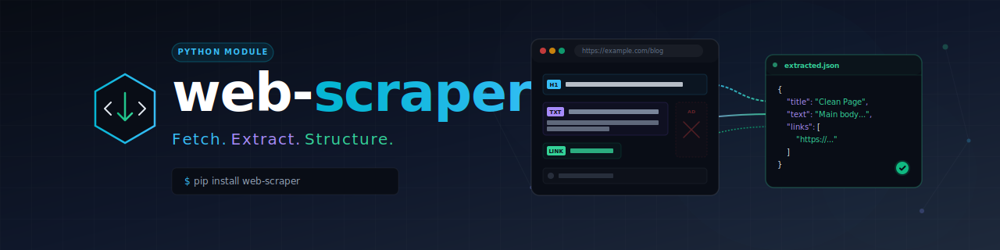

# web-scraper

[](llms.txt)



Standalone web scraper and lightweight browser control, extracted from the
BACH system (`web_scrape.py`). Fetch pages, pull out links and forms, inspect
response headers, extract clean main content as Markdown, and take screenshots.

- **Zero required dependencies** — the core runs on the Python standard library
  (`urllib` + `html.parser`/regex).
- **Optional upgrades** improve quality when installed:
  `requests`, `beautifulsoup4`, `trafilatura`, `selenium`.
- **SSRF guard** — internal/private targets are blocked by default.

## Install

```bash
# core only (stdlib)
pip install .

# recommended (robust HTTP + clean parsing + best extraction)
pip install ".[http,extract]"

# everything incl. screenshots
pip install ".[all]"
```

## CLI

```bash
web-scraper get      https://example.com
web-scraper links    https://example.com
web-scraper forms    https://example.com
web-scraper headers  https://example.com
web-scraper extract  https://example.com          # clean main text (Markdown)
web-scraper screenshot https://example.com --out shot.png

# raw dict as JSON
web-scraper extract https://example.com --json

# allow internal targets (SSRF guard off) / skip TLS verification
web-scraper get http://127.0.0.1:8080 --allow-private
web-scraper get https://self-signed.example --no-verify-ssl
```

## Library

```python
from web_scraper import WebScraper, extract

scraper = WebScraper(timeout=15, allow_private=False)

print(scraper.get("https://example.com")["status"])
print(scraper.links("https://example.com")["count"])
print(extract("https://example.com")["content"])   # convenience function
```

Every operation returns a plain `dict`, so it is easy to consume
programmatically. The CLI formats it for humans; `--json` prints the raw dict.

## Operations

| Operation | Returns | Notes |
|---|---|---|
| `get` | body (truncated to 10k chars), status, content-type | |
| `links` | deduplicated absolute links `{text, href}` | skips `javascript:`/`mailto:`/`tel:`/`#` |
| `forms` | forms with `action`, `method`, `fields` | |
| `headers` | full response headers | |
| `extract` | clean main content + `method`/`format` | `trafilatura` → `beautifulsoup` → `regex` |
| `screenshot` | saved PNG path | requires `selenium` extra + browser driver |

## Security

- `get`/`extract`/… resolve the target host and reject private, loopback,
  link-local, reserved and multicast addresses unless `allow_private=True`.
- Only `http`/`https` schemes are allowed.
- Downloads are capped at 5 MB (`max_bytes`) and redirects are followed by the
  HTTP backend.

## Provenance

Extracted from BACH `system/hub/web_scrape.py` (WebScrapeHandler, Task 996) on
2026-07-05. The BACH regex parsing was replaced by `beautifulsoup4`/`trafilatura`
with a regex fallback, and an SSRF guard plus size limit were added.

## Tests

To run the offline unit tests locally:

```bash
# Install development dependencies
pip install -e ".[dev]"

# Run tests
python -m pytest
```

## License

MIT — see [LICENSE](LICENSE).
