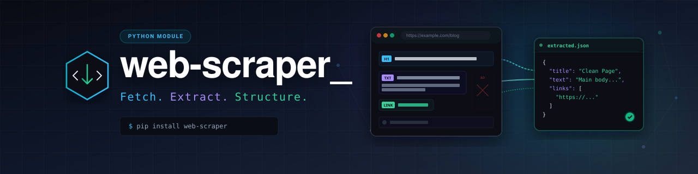
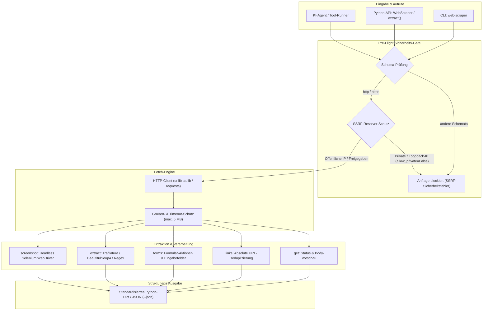

# web-scraper

[English](README.md) | [Deutsch](README_de.md)

[](https://github.com/ellmos-ai)
[](https://github.com/open-bricks)
[](https://github.com/ellmos-ai/web-scraper/actions/workflows/tests.yml)
[](llms.txt)
[](https://www.python.org/downloads/)
[](https://github.com/astral-sh/ruff)
[](LICENSE)
[](tests/)
[](SECURITY.md)
[](#sicherheit)



Eigenständiger Web-Scraper und leichte Browser-Steuerung, extrahiert aus dem
BACH-System (`web_scrape.py`). Seiten abrufen, Links und Formulare herauslösen,
Response-Headers ansehen, sauberen Haupttext als Markdown extrahieren und
Screenshots erstellen.

> [!NOTE]
> **KI- / Agenten-Integrationshinweis**: `web-scraper` wurde für autonome KI-Agenten-Pipelines entwickelt. Das Modul verarbeitet externe URLs sicher durch integrierten SSRF-Schutz gegen interne Subnetze sowie ein Standard-Download-Limit von 5 MB. Siehe [`llms.txt`](llms.txt) für Spezifikationen zur KI/Agenten-Integration.

- **Keine Pflicht-Abhängigkeiten** — der Kern läuft mit der Standardbibliothek
  (`urllib` + `html.parser`/Regex).
- **Optionale Extras** verbessern das Ergebnis, wenn installiert:
  `requests`, `beautifulsoup4`, `trafilatura`, `selenium`.
- **SSRF-Schutz** — interne/private Ziele sind per Default blockiert.

## Architektur & Pipeline



## Installation

```bash
# nur Kern (stdlib)
pip install .

# empfohlen (robustes HTTP + sauberes Parsing + beste Extraktion)
pip install ".[http,extract]"

# alles inkl. Screenshots
pip install ".[all]"
```

## CLI

```bash
web-scraper get      https://example.com
web-scraper links    https://example.com
web-scraper forms    https://example.com
web-scraper headers  https://example.com
web-scraper extract  https://example.com          # sauberer Haupttext (Markdown)
web-scraper screenshot https://example.com --out shot.png

# rohes dict als JSON
web-scraper extract https://example.com --json

# interne Ziele erlauben (SSRF-Schutz aus) / TLS-Prüfung überspringen
web-scraper get http://127.0.0.1:8080 --allow-private
web-scraper get https://self-signed.example --no-verify-ssl
```

## Als Bibliothek

```python
from web_scraper import WebScraper, extract

scraper = WebScraper(timeout=15, allow_private=False)

print(scraper.get("https://example.com")["status"])
print(scraper.links("https://example.com")["count"])
print(extract("https://example.com")["content"])   # Convenience-Funktion
```

Jede Operation gibt ein einfaches `dict` zurück — leicht programmatisch
weiterzuverarbeiten. Die CLI formatiert es lesbar; `--json` gibt das rohe dict aus.

### KI-Agenten- & Tool-Integration

Für autonome KI-Agenten, die sauberen Seiteninhalt für den LLM-Prompt-Kontext benötigen:

```python
from web_scraper import extract

def fetch_page_context(url: str) -> str:
    """Ruft bereinigten Markdown-Text für den LLM-Kontext ab, geschützt gegen SSRF."""
    result = extract(url)
    if result.get("error"):
        raise RuntimeError(f"Scraping fehlgeschlagen: {result['error']}")
    return result["content"]
```

## Operationen

| Operation | Rückgabe | Hinweis |
|---|---|---|
| `get` | Body (auf 10k Zeichen gekürzt), Status, Content-Type | |
| `links` | deduplizierte absolute Links `{text, href}` | überspringt `javascript:`/`mailto:`/`tel:`/`#` |
| `forms` | Formulare mit `action`, `method`, `fields` | |
| `headers` | vollständige Response-Headers | |
| `extract` | sauberer Haupttext + `method`/`format` | `trafilatura` → `beautifulsoup` → `regex` |
| `screenshot` | Pfad des gespeicherten PNG | braucht `selenium`-Extra + Browser-Driver |

## Sicherheit

- `get`/`extract`/… lösen den Ziel-Host auf und lehnen private, Loopback-,
  Link-Local-, reservierte und Multicast-Adressen ab (außer `allow_private=True`).
- Nur `http`/`https`-Schemata sind erlaubt.
- Downloads sind auf 5 MB begrenzt (`max_bytes`), Redirects folgt das HTTP-Backend.

## Herkunft

Extrahiert aus BACH `system/hub/web_scrape.py` (WebScrapeHandler, Task 996) am
2026-07-05. Das BACH-Regex-Parsing wurde durch `beautifulsoup4`/`trafilatura`
mit Regex-Fallback ersetzt; SSRF-Schutz und Größenlimit kamen hinzu.

## Tests

So führst du die Offline-Unit-Tests lokal aus:

```bash
# Entwicklungs-Abhängigkeiten installieren
pip install -e ".[dev]"

# Tests ausführen
python -m pytest
```

## Lizenz

MIT — siehe [LICENSE](LICENSE).
